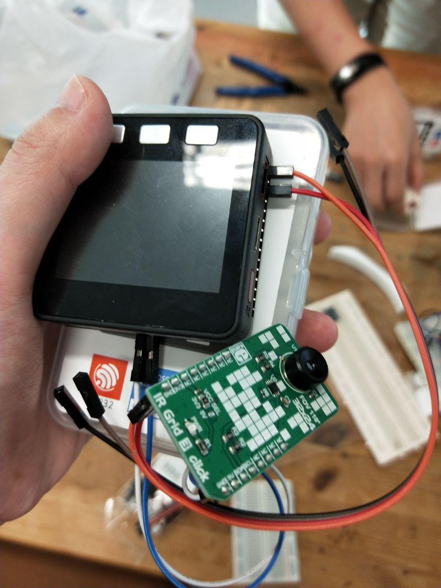
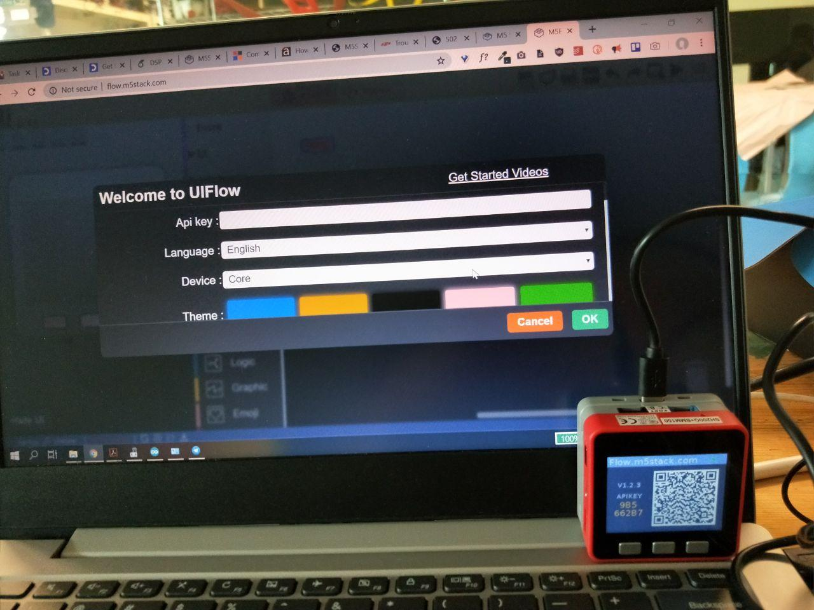

# Setup Instructions

This document contains instructions for sensors and devices we experimented with, but not implemented in the final solution!

## Hardware Datasheets

- [Grideye AMG8833](https://cdn.sparkfun.com/assets/4/1/c/0/1/Grid-EYE_Datasheet.pdf)
- [PIR Sensor HC-SR501](http://www.datasheetcafe.com/hc-sr501-datasheet-detector/)
- [ESP8266](https://www.espressif.com/en/products/hardware/esp8266ex/overview)
- [M5Stack](https://m5stack.com)

## Hardware Setup

### M5Stack

#### Connection to UIFlow

By inputting the API key that is shown on the screen, we were able to perform block programming and uploading of code on the web interface. But later on, we did not really require this interface.

### ESP8266

#### Serial Communication

Here is a screenshot from the documentation of the more important commands that we have used so far to communicate in serial with ESP8266.

- AT
  - get OK response if serial communication works
- AT+CWJAP="network-ssid","network-password"
  - for connecting to an access point
- AT+CWLAP
  - to get list of access points around

:warning: If you can't run any of the commands above try setting the mode of the ESP8266 by sending a message "AT+CWMODE_CUR=3"

If used as a standalone board, can wire to arduino and short the reset and ground pins on the arduino. Remember to remove the short if flashing arduino sketches.