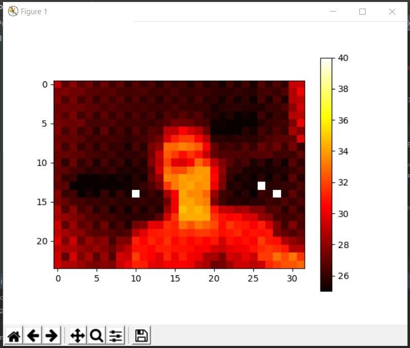

# Setup Instructions for MLX90640

Table of Contents
- [Setup Instructions for MLX90640](#setup-instructions-for-mlx90640)
  - [Hardware Datasheets](#hardware-datasheets)
      - [Simple Data Collection & Visualization](#simple-data-collection--visualization)
      - [Screenshot of setup with ESP32](#screenshot-of-setup-with-esp32)
      - [Why is there missing pixels in my visualization?](#why-is-there-missing-pixels-in-my-visualization)
    - [Common Issues](#common-issues)
      - [There is a problem while installing packages...](#there-is-a-problem-while-installing-packages)
      - [Pygifiscle](#pygifiscle)
      - [Matplotlib Visualization for Ubuntu Users](#matplotlib-visualization-for-ubuntu-users)
- [Other Useful Resources](#other-useful-resources)

## Hardware Datasheets

- [MLX90640](https://www.melexis.com/en/documents/documentation/datasheets/datasheet-mlx90640)
- [ESP32](https://www.espressif.com/sites/default/files/documentation/esp32_datasheet_en.pdf)

#### Simple Data Collection & Visualization

There are 2 ways of collecting data from MLX90640. Either you can obtain the data through serial output or through i2c. 
- For serial output, refer to `MLX90640/rpi_to_mlx_serial.py`
- For i2c, refer to `MLX90640/rpi_to_mlx_i2c.py`

Here are some parameters that you need to be aware of and change accordingly. 

1. **Mode of the program:**
   - `DEBUG_MODE` to visualize the real-time heatmap plot only
   - `WRITE_MODE` to store the serial output data as `.npy` objects.
     - By default, the name of the numpy object is of the following format e.g. `20200406_222532.npy`.
     - If you would like to change this, you would have to go to `MLX90640/file_utils.py` to change it.
2. **Serial parameters initialization:**
   - `SERIAL_PORT`: Check if the serial port that you are using corresponds to what is indicated in the program. If not, change it. Otherwise you will encounter a Permission Error in accessing a port.
   - `BAUD_RATE`: Check with your arduino code.
3. **Data Path:**
   - `DATA_PATH`: where you want to store the `.npy` objects

#### Screenshot of setup with ESP32

#### Why is there missing pixels in my visualization?

In the datasheet, it was stated that it does have some missing pixels. To resolve this, we performed interpolation for every frame of data that we get from the serial output. You can refer to it in the function that we wrote, `interpolate_values(df)`. So assuming you did not change the main program that we wrote, you would not see the missing pixels.

Example of output that we got before we performed interpolation

### Common Issues

#### There is a problem while installing packages...

You need to have at least Python v3.5, some packages might not be available for lower versions.

#### Pygifiscle 

`FileNotFoundError: [Errno 2] No such file or directory: 'gifsicle': 'gifsicle'`

Please refer to the [README.md of the repo](https://github.com/LucaCappelletti94/pygifsicle) and follow the instructions for your machine to resolve this error.

#### Matplotlib Visualization for Ubuntu Users

:warning: For Ubuntu WSL users, please [install XMING X server](https://sourceforge.net/projects/xming/) and run `export DISPLAY=:0` for the matplotlib visualization to work. Otherwise the function will run but there will be no display window.

# Other Useful Resources

- [Arduino Delay vs Python Delay](https://arduino.stackexchange.com/questions/12808/handle-reading-timing-in-python-using-pyserial)
- [Pyserial API](https://arduino.stackexchange.com/questions/12808/handle-reading-timing-in-python-using-pyserial)
- [Resolving Lag in Matplotlib Realtime Visualization](https://bastibe.de/2013-05-30-speeding-up-matplotlib.html)
- [Using the esp8266 wifi module with arduino uno](https://medium.com/@cgrant/using-the-esp8266-wifi-module-with-arduino-uno-publishing-to-thingspeak-99fc77122e82)
