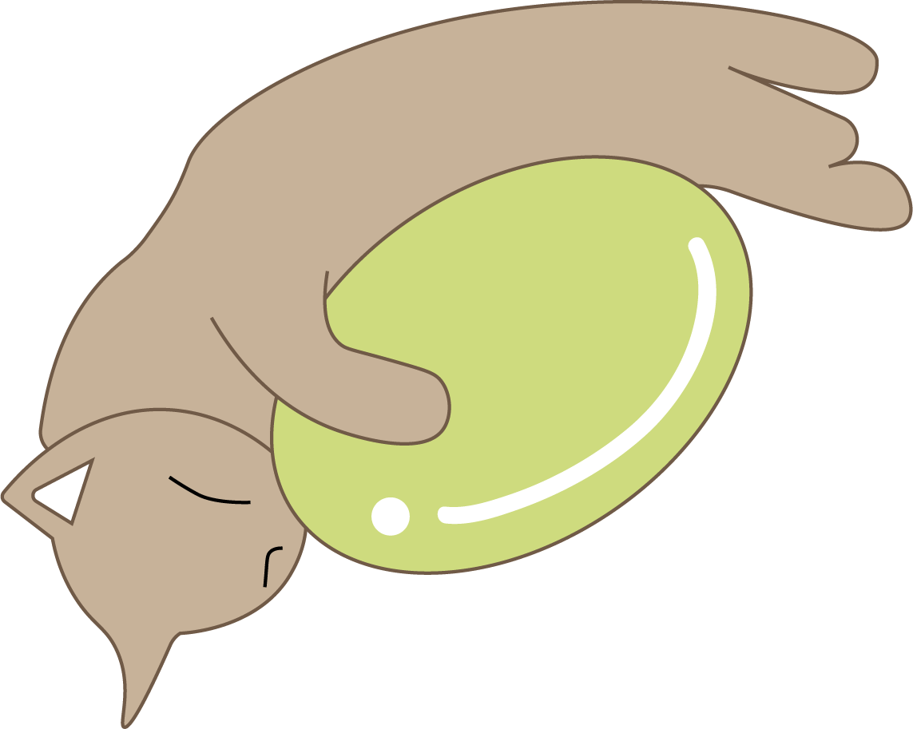
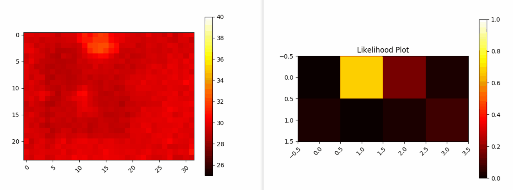
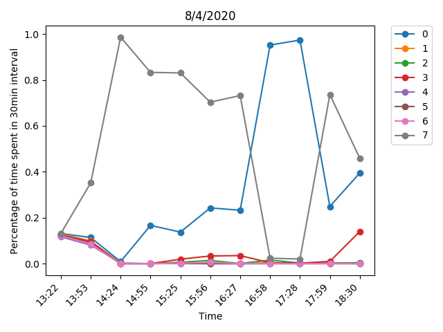
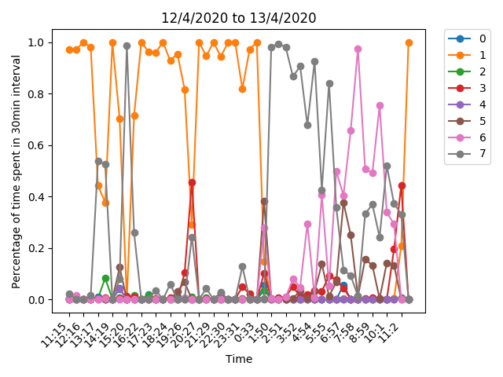

    
    
<i>Silently guarding your loved ones</i>

---

**Table of Contents**
- [Introduction to the Project](#introduction-to-the-project)
- [Progress](#progress)
- [Setup instructions for this repo](#setup-instructions-for-this-repo)

## Introduction to the Project

- **Title**: Unobstructive Monitoring of Vulnerable Elderly
- **Problem Statement**: To mitigate physical and mental health risks faced by the elderly through remote monitoring that preserves the privacy of vulnerable elderly individuals
- **Project Goal**: To develop a _non-invasive_ home-monitoring system for vulnerable elderly that provides _unobtrusive fall detection_ and _activity level tracking_ that preserves individual privacy and can be readily integrated into existing infrastructure

This repository contains the code for testing sensors and data analysis for the **activity level monitoring subsystem**. For the fall detection subsystem, refer [here](https://github.com/Nekostone/Fall_Detection)

## Progress

Presence Detection (from Review 1)

    

Activity Level Analysis (from Review 2)

    
    

Review 3

[coming soon!]

## Setup instructions for this repo

Refer [here](SETUP.md)