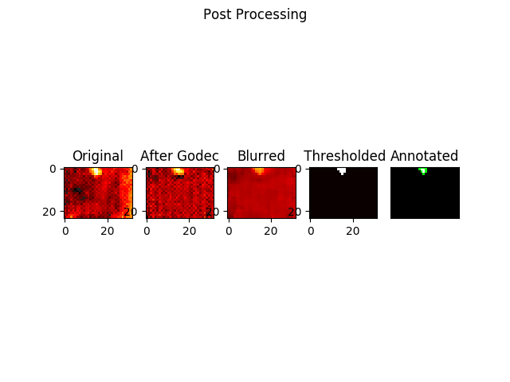

    
    
<i>Silently guarding your loved ones</i>

---

**Table of Contents**
- [Introduction to the Project](#introduction-to-the-project)
- [Progress](#progress)
- [Device Requirements](#device-requirements)
- [Setup instructions for this repo](#setup-instructions-for-this-repo)

## Introduction to the Project

- **Title**: Unobstructive Monitoring of Vulnerable Elderly
- **Problem Statement**: To mitigate physical and mental health risks faced by the elderly through remote monitoring that preserves the privacy of vulnerable elderly individuals
- **Project Goal**: To develop a _non-invasive_ home-monitoring system for vulnerable elderly that provides _unobtrusive fall detection_ and _activity level tracking_ that preserves individual privacy and can be readily integrated into existing infrastructure

This repository contains the code for testing sensors and data analysis for the **activity level monitoring subsystem**. For the fall detection subsystem, refer [here](https://github.com/Nekostone/Fall_Detection)

## Progress

Presence Detection (from Review 1)

 
 Demo 

    

---
Activity Level Analysis (from Review 2)

 
 Demo 

    
    

---

Background Subtraction Pipeline (Review 3)

 
 Demo 

> Credits to [Andrews Sobral](https://github.com/andrewssobral/godec) for a GoDec Python Implementation and [OpenCV](https://opencv.org/) for computer vision API. We experimented a lot with the different functions and parameters available before achieving this r

## Device Requirements

The Activity Levels Monitoring subsystem (as of Review 4) require the following devices:
- MLX90640
- RPI 3b
- NUC / Central Processor
  

> For instructions on older sensors that we have experimented with, refer [here](Archived/SETUP.md).

## Setup instructions for this repo

- For general testing with the MLX90640, refer to [MLX_SETUP.md](MLX_SETUP.md)
- For setting up the RPI, refer to [RPI_SETUP.md](RPI_SETUP.md)
- For setting up the NUC, refer to [NUC_SETUP.md](NUC_SETUP.md)