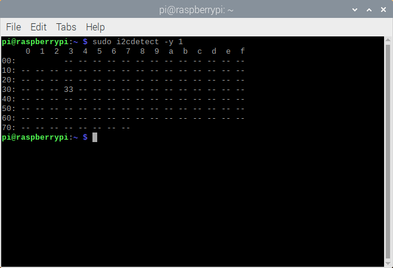

# Setup instructions for RPI
## Install necessary packages and dependencies

Before installing anything else, first install the following dependencies:

For **opencv**:
```shell
sudo apt install libatlas3-base libwebp6 libtiff5 libjasper1 libilmbase23 libopenexr23 libavcodec58 libavformat58 libavutil56 libswscale5 libgtk-3-0 libpangocairo-1.0-0 libpango-1.0-0 libatk1.0-0 libcairo-gobject2 libcairo2 libgdk-pixbuf2.0-0 libqtgui4 libqt4-test libqtcore4
```

For the **I2C connection with MLX90640**:
```shell
sudo apt-get install -y python-smbus
sudo apt-get install -y i2c-tools
```

You also will need to **enable I2C on the RPI** by executing:
```shell
sudo nano /boot/config.txt
``` 
and uncommenting (by removing the # before it.)
```editorconfig
dtparam=i2c_arm=on
```

Next, create a **virtual environment** (venv or virtualenv) and execute the following:
```shell
pip install numpy cython
```
Installing scipy is a bit more involved:
1. Download the latest scipy wheels from http://www.piwheels.org/simple/scipy
2. In the activated venv, navigate to the folder with the wheel file and execute:
```shell
pip install <the-wheel-file-you-downloaded.whl>
```

The other packages can be installed using:
```shell
pip install -r MLX90640/requirements.txt
```

⚠️ Don't forget to reboot after installing! 

## Check that your Rpi config is ready

You can check that I2C is enabled by executing
```commandline
sudo i2cdetect -y 1
```
You should see this:



You can also run the install command for packages to see if the requirements are all fulfilled.
