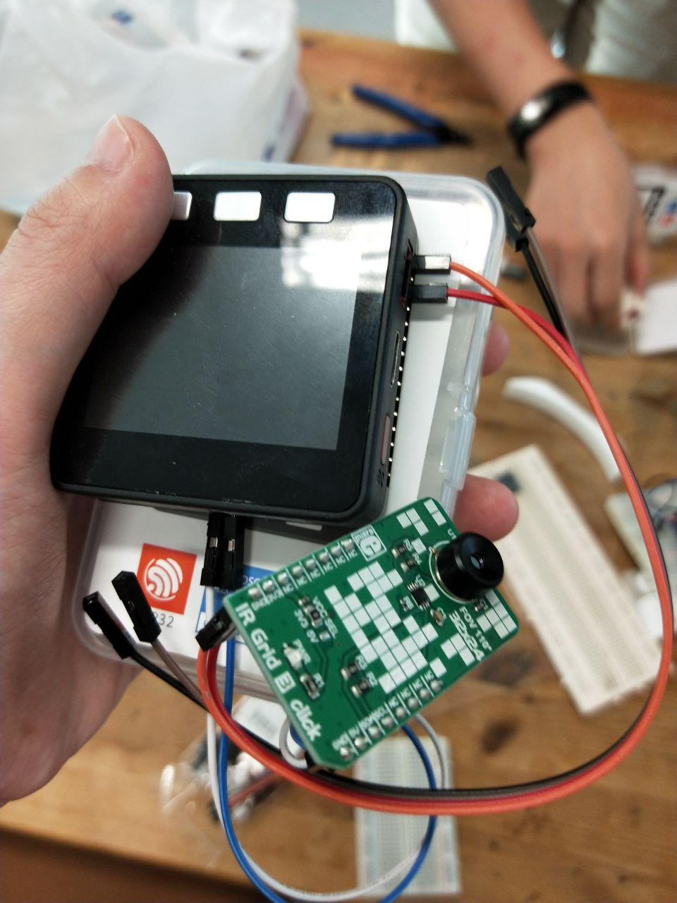
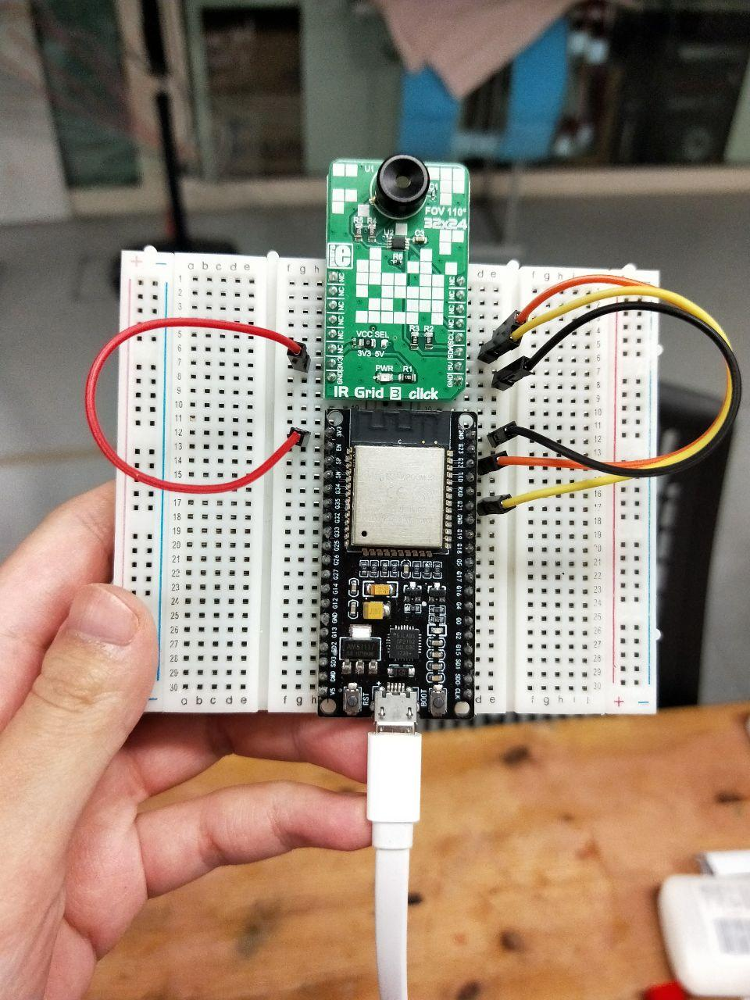
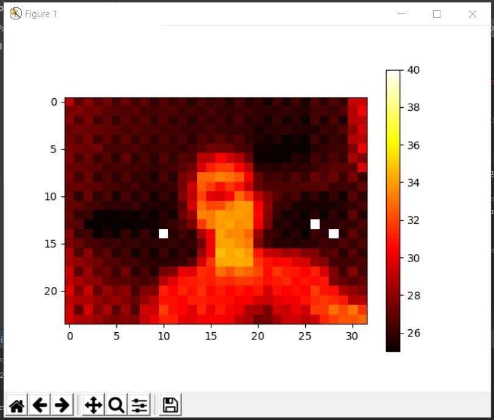
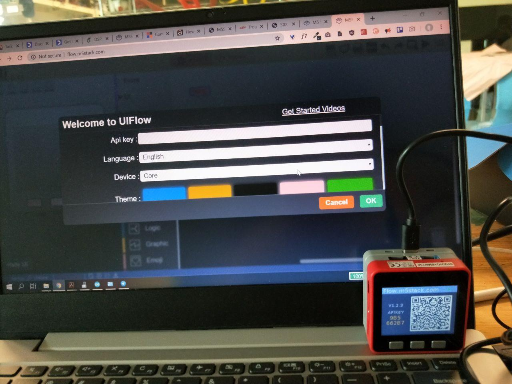

# Setup Instructions

Table of Contents

- [Setup Instructions](#setup-instructions)
  - [Hardware Datasheets](#hardware-datasheets)
  - [Hardware Setup](#hardware-setup)
    - [Grideye MLX90640](#grideye-mlx90640)
      - [Setup with M5Stack](#setup-with-m5stack)
      - [Setup with ESP32](#setup-with-esp32)
      - [Data Collection & Visualization](#data-collection--visualization)
      - [Why is there missing pixels in my visualization?](#why-is-there-missing-pixels-in-my-visualization)
    - [M5Stack](#m5stack)
      - [Connection to UIFlow](#connection-to-uiflow)
    - [ESP8266](#esp8266)
      - [Serial Communication](#serial-communication)
  - [Install necessary packages](#install-necessary-packages)
    - [Common Issues](#common-issues)
      - [There is a problem while installing packages...](#there-is-a-problem-while-installing-packages)
      - [Pygifiscle](#pygifiscle)
      - [Matplotlib Visualization for Ubuntu Users](#matplotlib-visualization-for-ubuntu-users)
- [Other Useful Resources](#other-useful-resources)

## Hardware Datasheets

- [Grideye AMG8833](https://cdn.sparkfun.com/assets/4/1/c/0/1/Grid-EYE_Datasheet.pdf)
- [Grideye MLX90640](https://www.melexis.com/en/documents/documentation/datasheets/datasheet-mlx90640)
- [PIR Sensor HC-SR501](http://www.datasheetcafe.com/hc-sr501-datasheet-detector/)
- [ESP32](https://www.espressif.com/sites/default/files/documentation/esp32_datasheet_en.pdf)
- [ESP8266](https://www.espressif.com/en/products/hardware/esp8266ex/overview)
- [M5Stack](https://m5stack.com)

## Hardware Setup

The listed hardware below are the ones that we have personally tested before, but not all are implemented in the final solution. 😅 Hopefully these will still be useful in your debugging!

### Grideye MLX90640

#### Setup with M5Stack



#### Setup with ESP32



#### Data Collection & Visualization

The code for data collection and visualization can be found in `grideye/MLX90640/__main__.py`.

Here are some parameters that you need to be aware of and change accordingly.

1. **Mode of the program:**
   - `DEBUG_MODE` to visualize the real-time heatmap plot only
   - `WRITE_MODE` to store the serial output data as `.npy` objects.
     - By default, the name of the numpy object is of the following format e.g. `20200406_222532_grideye.npy`.
     - If you would like to change this, you would have to go to `grideye/MLX90640/file_utils.py` to change it.
2. **Serial parameters initialization:**
   - `SERIAL_PORT`: Check if the serial port that you are using corresponds to what is indicated in the program. If not, change it. Otherwise you will encounter a Permission Error in accessing a port.
   - `BAUD_RATE`: Check with your arduino code.
3. **Data Path:**
   - `DATA_PATH`: where you want to store the `.npy` objects

After the parameters are settled, you can now run the program as such.

```python
python grideye/MLX90640
```

#### Why is there missing pixels in my visualization?

In the datasheet, it was stated that it does have some missing pixels. To resolve this, we performed interpolation for every frame of data that we get from the serial output. You can refer to it in the function that we wrote, `interpolate_values(df)`. So assuming you did not change the main program that we wrote, you would not see the missing pixels.

Example of output that we got before we performed interpolation



### M5Stack

#### Connection to UIFlow

By inputting the API key that is shown on the screen, we were able to perform block programming and uploading of code on the web interface. But later on, we did not really require this interface.



### ESP8266

#### Serial Communication

Here is a screenshot from the documentation of the more important commands that we have used so far to communicate in serial with ESP8266.

- AT
  - get OK response if serial communication works
- AT+CWJAP="network-ssid","network-password"
  - for connecting to an access point
- AT+CWLAP
  - to get list of access points around


:warning: If you can't run any of the commands above try setting the mode of the ESP8266 by sending a message "AT+CWMODE_CUR=3"

If used as a standalone board, can wire to arduino and short the reset and ground pins on the arduino. Remember to remove the short if flashing arduino sketches.

## Install necessary packages

```python
pip install -r requirements.txt
```

### Common Issues

#### There is a problem while installing packages...

You need to have at least Python v3.5, some packages might not be available for lower versions.

#### Pygifiscle 

`FileNotFoundError: [Errno 2] No such file or directory: 'gifsicle': 'gifsicle'`

Please refer to the [README.md of the repo](https://github.com/LucaCappelletti94/pygifsicle) and follow the instructions for your machine to resolve this error.

#### Matplotlib Visualization for Ubuntu Users

:warning: For Ubuntu WSL users, please [install XMING X server](https://sourceforge.net/projects/xming/) and run `export DISPLAY=:0` for the matplotlib visualization to work. Otherwise the function will run but there will be no display window.

# Other Useful Resources

- [Arduino Delay vs Python Delay](https://arduino.stackexchange.com/questions/12808/handle-reading-timing-in-python-using-pyserial)
- [Pyserial API](https://arduino.stackexchange.com/questions/12808/handle-reading-timing-in-python-using-pyserial)
- [Resolving Lag in Matplotlib Realtime Visualization](https://bastibe.de/2013-05-30-speeding-up-matplotlib.html)
- [Using the esp8266 wifi module with arduino uno](https://medium.com/@cgrant/using-the-esp8266-wifi-module-with-arduino-uno-publishing-to-thingspeak-99fc77122e82)
