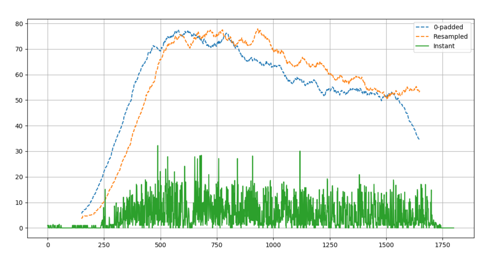

# Activity Levels Implementation

## Binary Presence Sensors, MLX

1. Binary Presence Sensors tell which Rpi to turn on MLX for data collection. All Rpis are subscribed to the MQTT broker and start data collection based on the topic and message they receive. 
2. Data collection starts by running `save_serial_output()` in `main.py`.
3. Data is collected in the form of .npy files. 
   - With the function parameter `directory_sort="day"`, the naming format of the .npy files is `"%Y.%m.%d_%H%M%S.npy"`

4. If binary presence sensors tells current Rpi that user has entered another room instead, stop MLX data collection.

## Centroid Displacement History on the Rpi

Say for a single room, you have data recorded on 14 July 2020 from 8.13am to 09.23am. This would mean you have numpy arrays of 20200714_081300.npy to 20200714_092300.npy.

1. Run `get_centroid_displacement_history(files)` on the data collected above, you will get this dictionary which you can save as a .json.
```
{
    "20200714_081300": [x1,... x1800], # 30min interval
    "20200714_084300": [x1,... x1800], # 30min interval
    "20200714_091300": [x1,... x600] # since 0913 to 0923 is 10mins
}
```

2. Sometimes, the dictionary above may not be sorted by keys in ascending order. Hence, a helper function was created to sort the dictionary by keys and to only have the keys as time. Run `json_to_timedict(json_path)`, where json_path is where you stored the .json file. This will produce the following output.

```
{
    "0813": [x1,... x1800],
    "0843": [x1,... x1800],
    "0913": [x1,... x600] 
}
```

If you wish, this function comes with other parameters that you can set to allow you to format the data here to produce a cleaner data structure. Running `json_to_timedict(json_path, shift_30min=True, interpolate=True)`  produces the following output.

```
{
    "0800": [x1,... x1800],
    "0830": [x1,... x1800],
    "0900": [x1,... x1800]
}
```

**A word of warning**: the interpolation performed here to obtain the cleaner structure is fairly inaccurate. Here, the missing frames are interpolated from 8am-8.13am, and 9.23am-9.30am. Of course this is not ideal but in case you wish to fill the missing data just to see a general plot of activity levels in a short period of time.

> For comparison of the formatted vs unformatted history from json_to_timedict, refer to `MLX90640/sample_activity_levels` folder for respective sample .json files.

1. This json file will be encoded and be sent by the Rpi as a MQTT message to the NUC.
2. With the dictionary from the json file itself, we can make a simple plot of quantification of activity levels by running `get_activity_levels(dict)`. An example of the output is shown as such:



## Quantification of Activity Levels at the NUC

During a time interval, say 9am-9.30am, the NUC receives different MQTT messages that contains a json. These MQTT messages can be loaded into their respective dictionary by the json module. An example scenario would be:

0910-0912: BEDROOM
0912-0913: LIVINGROOM
0913-0924: BEDROOM
0924-0925: LIVINGROOM
0925-0930: BEDROOM

---

1. After the time has passed 9.30am, the NUC should call `stitch_data(dictionaries)` for bedroom and living room dictionaries separately. e.g. for BEDROOM, the dictionaries will be combined to produce this output, where missing data will be **zero-padded**.
```
{
    "0900-0930": [...]
}
```

> ⚠️ **TODO**: TO MAKE IT EASIER TO PERFORM THE ZERO-PADDING AT SPECIFIC POSITIONS, IT MAY EASIER TO HAVE A LIST/DICT OF START + STOP MLX RECORDING TIMES. TO DO THIS, `json_to_timedict` should be revamped.

2. Similar as what we tried to test on the Rpi, at the NUC, we will analyze the displacement history by calling `get_activity_levels(compiled_dictionary)`. The result here should be saved somewhere so that future analysis can be performed across days, weeks or months. 

> ⚠️ **TODO**: How this should be done is up for discussion before implementation.